<div align="center">
  
</div>

# Cert Recon

[](https://python.org)
[](LICENSE)

> **Passive Certificate Transparency (CT) subdomain discovery.**

## Usage

```bash
# Passive discovery from crt.sh (asks for authorization confirmation)
python cert_recon.py example.com --output certs.json

# Skip the confirmation prompt only when authorized
python cert_recon.py example.com --yes
```

The target must be a DNS domain (not a URL, wildcard, IP address, or host:port).
The tool makes one read-only HTTPS query to crt.sh and does not resolve or
connect to discovered names. Results are certificate-name evidence only, not
confirmation that a name currently exists in DNS or is reachable. Requests
time out after 20 seconds; responses are limited to 5 MiB and 25,000
certificates, with at most 100,000 name candidates processed and 10,000 names
retained. The output marks when either processing limit truncates results.
Failures return a non-zero exit status and are reported separately from
discovery results.

## Disclaimer

> **Authorized security testing only.**

## Author

**Omar Khalid** — [omareldemery.com](https://omareldemery.com) | [@amooryx](https://github.com/amooryx)
